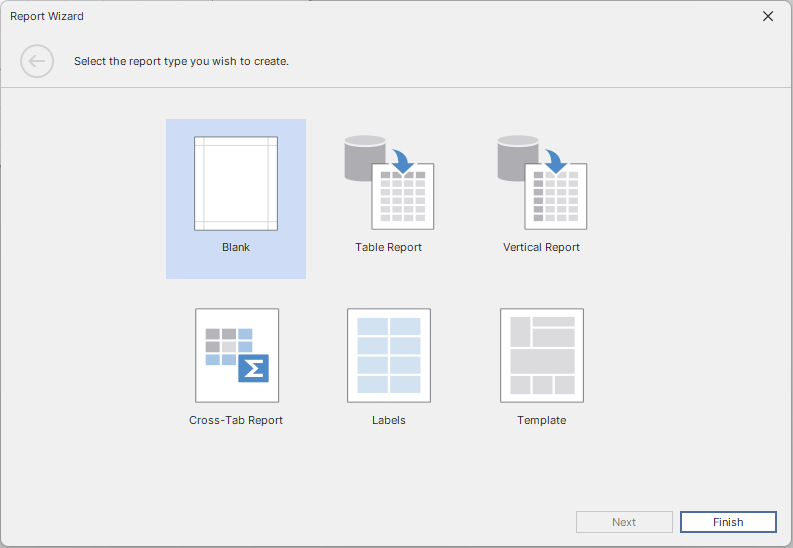
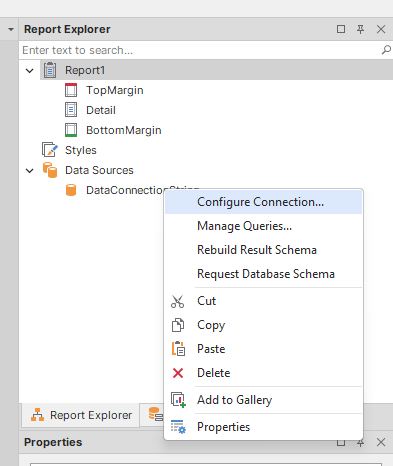
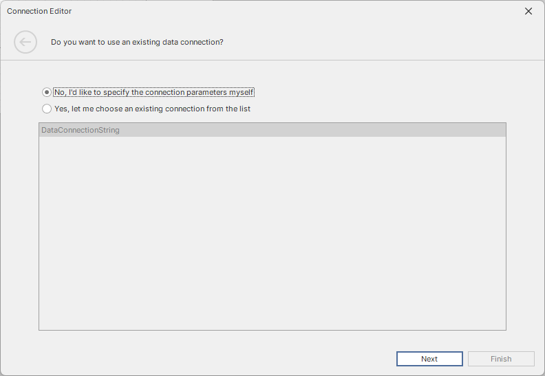
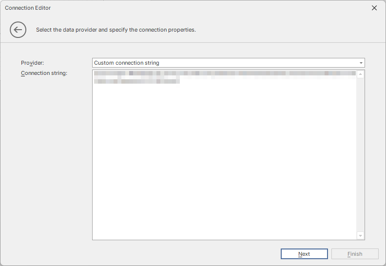

# 08. DevExpress Reporting

## Stating

### Crear Report

`Archivo` -> `Nuevo informe usando el asistente...`

Seleccionarem la opcio mes indicada.



### Crear connection string

`Explorador de informes` -> `Data Sources` -> `DataConnectionString` -> `Configurar connexion` (click dret)



Un cop dins seleccionarem que volem fer una connection string manualment:



I despres escollim una `Custom connection string`:



```plaintext
xpoprovider=MSSqlServer;server={{SQL Server Instance}};database={{Database Name}};trustservercertificate=True;User={{SQL Server User}};Password={{Password}}
```

## Crear query


