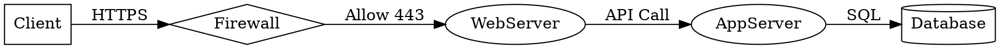
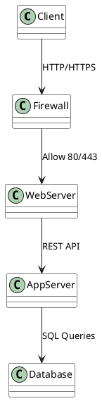

# Diagrames

[Exemples](https://kroki.io/examples.html#nwdiag)

```txt
graphviz
digraph network {
    rankdir=LR;

    Client [shape=box];
    Firewall [shape=diamond];
    WebServer [shape=ellipse];
    AppServer [shape=ellipse];
    Database [shape=cylinder];

    Client -> Firewall [label="HTTPS"];
    Firewall -> WebServer [label="Allow 443"];
    WebServer -> AppServer [label="API Call"];
    AppServer -> Database [label="SQL"];
}
```




