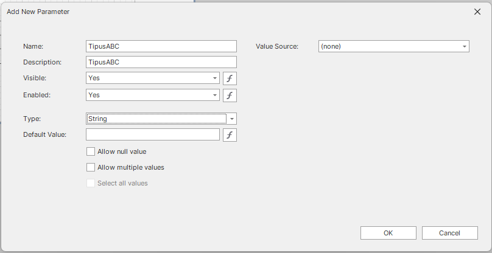
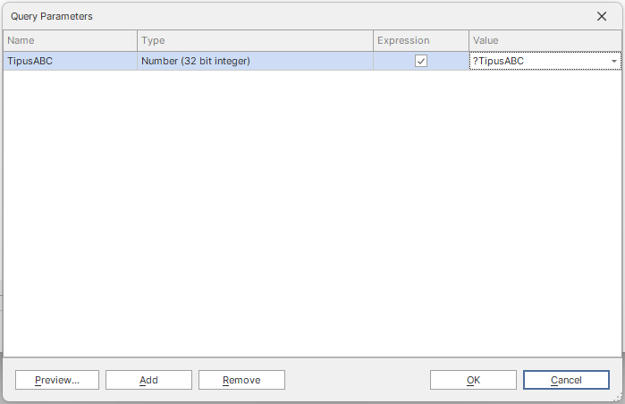
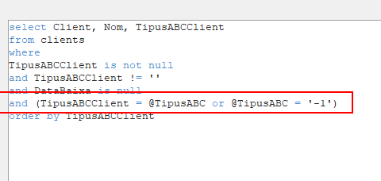

# 08. DevExpress Reporting

## Starting

### Iniciar Eina

Per iniciar l'eina haurem de iniciar sessio amb l'ERP de `Nowtech` que te llicencia aplicada o sino en una BD local amb llicencia `Evaluacion` que tambe ens permet obrir el dissenyador.

Un cop dins l'ERP anirem al `Dashboard`, 3 punts i buscarem `Diseñador de informes`:

![arrancar_IDE]

### Crear Report

Per crear un nou report/informe usarem l'assistent de creacio que trobarem a la barra superior a `File` -> `New via Wizard...`

Tindrem varies opcions, sobretot plantilles. Podrem visualitzarles per veure si alguna ens interessa i sino podem fer un informe en blanc (`Blank`):

![new_report_wizard]

### Crear connection string

Un cop som dins, a la part dreta trobarem el `Report Explorer` on dintre del seu llistat, trobarem el `Report` i els `DataSources`. Per poder-nos connectar a la BD farem clic dret al `DataConnectionString` i anirem a la opcio `Configure Connection...`:

![data_source_configure_connection_string]

Un cop dins, seleccionarem la opcio per definir manualment una connexio i despres escollirem el proveidor `Custom connection string`

![data_source_connection_editor]

![data_source_connection_editor_custom_connection]

La `Connection String` que utilitzarem sera en base a aquesta, molt important l'apartat de `trustservercertificate`:

```udl
xpoprovider=MSSqlServer;server={{SQL Server Instance}};database={{Database Name}};trustservercertificate=True;User={{SQL Server User}};Password={{Password}}
```

## Crear query

Un cop configurada la `Connection String`, haurem de configurar les queries, per fer aixo, anirem al DataConnectionString i farem clic dret i escollirem la opcio `Manage Queries...`:

![query_manager]

Un cop obert el gestor de queries a dalt a l'esquerra li direm `Add` i ens creara una nova `Query`.

### Automatic

Aquest gestor de queries, per defecte utilitza les relacions creades a BD per gestionar de forma visual com encadenar les taules:

![query_manager_create_query_auto_join]

Com veiem les relacions al estar fetes correctament a BD, DevExpress ho detecta i ja les forma de forma automatica.

<Columns>
<Column>
En cas de que no les trobi, ens ho consultara:
</Column>
<Column>
En aquest cas seria aixi:
</Column>
</Columns>
<Columns>
<Column>

![query_manager_create_query_join_prompt]
</Column>
<Column>

![query_manager_create_query_join_prompt_completed]
</Column>
</Columns>
I ens donara aquest resultat:

![query_manager_create_query_join_prompt_result]

### Manual

Tambe podem fer la query manualment, podem apretar el buto que diu `Edit SQL` a la part superior dreta el qual ens permetra escriure una query lliurament.

![query_manager_create_manual_query]

## Fer un disseny

Un cop tenim la query feta, si anem al `Field List` trobarem les nostres querys i les seves columnes:

![field_list_acabat]

Ara ja podem comencar a dissenyar tot el report, en aquest cas, un report de N Client, Nom Client i TipusABC.

Per fer aixo seelccionarem les 3 columnes i les arrastrarem a la part esquerre a la Banda anomenada `Detail`, aixo ens creara una taula visual, la qual ens posara els tres camps en fila i amb un espaiat equitatiu. Si volem podem redimensionar els camps cosa que fara que uns s'aixamplin mentre els altres es redueixen:

![designer_add_clients_data]

Ara si mirem en el `Report Explorer` veurem que en el tree del Detail, hi ha una taula, una fila i els 3 camps estipulats.

![designer_add_clients_data_report_explorer_tree]

Ara perque quedi una mica mes bonic, a l'apartat del `Top Margin` (s'imprimeix com a marge superior de cada fulla, tambe existeix el `Bottom Margin`), arrastrarem de la part esquerra de la pantalla una taula, la qual en deixar-la anar en el Top Margin, ens donara 3 celles, les posicionarem amb el mateix ample que les de la banda `Detail` i els hi posarem el nom de les dades.

![designer_add_top_margin_cell_label]

### Resultat al tree

![designer_explorer_tree_after_top_margin]

## Agrupacions

Per poder fer una agrupacio anirem a la part inferior a una pestanya de `Group and Sort` i alla podrem afegir tant un grup com un ordre. Per afegir una agrupacio, farem clic a `Add a Group` i seleccionarem la columna a fer l'agrupacio:

![designer_add_grouping]

Despres podrem moure les celes de titol a aquesta banda i afegir un titol de grup:

![designer_grouping_set_header]

Per obtenir:

![resultat_agrupacions_capcalera]

Podem especificar que faci un salt de pagina al acabar el grup i comencar un de nou:

![grouping_poage_break]

## Detalls finals

Ara aplicarem que les linies imparelles tinguin un estil de fons, siguin grises per poder veure millor la linia que enfoques, selecionant la banda `Detail` i a l'apartat de `Properties` buscarem `Styles` i dins d'ella `Odd Style`. Un cop a la propietat seleccionarem el desplegable i seleccionarem un Style ja creat, en cas de voler crear-ne un de nou, seleccionarem la opcio de `(New)`. Un cop aplicat en nou `Style` el podrem tunejar a les nostres necessitats, en aquest cas el `Background Color` li assignarem un color grisos.

Tambe com que l'informe pot ser molt llarg, li posarem en el `Bottom Margin` un component anomenat `Page info` el qual ens informa de quina pagina estem. Podem personalitzar-lo quan cliquem l'objecte i li donem a la rodeta ja que podem posar el numero de pagina en nombres romans o fins i tot la data de impressio del report, cosa que posarem al `Top Margin`.

![ultims_detalls]

## Resultat

![resultat]

## Advanced

## Parametria del report

Entrarem al `Field List` i buscarem l'opcio de `Parameters` on li farem clic dret i `Add Parameter` i despres configurarem el parametre:



Podem tambe configurar una llista de possibles valors per el parametre.

## Parametria de les querys

Per traspassar els parametres del report a la query, entrarem al Query Manager i a la part inferior apretarem el buto `Edit Parameters...`, li posarem un Nom i li posarem que `Expression = True` i al `Value` li posarem el parametre del Report posant un interrogant (`?`) a davant, podem triar-ho del desplegable.



Un cop definit el parametre, entrarem a la query i afegirem una condicio where a la SQL:



[data_source_configure_connection_string]: /nowtech-docs/nowtech/documentacio_express/08_devexpress_reporting/data_source_configure_connection_string.png
[data_source_connection_editor]: /nowtech-docs/nowtech/documentacio_express/08_devexpress_reporting/data_source_connection_editor.png
[data_source_connection_editor_custom_connection]: /nowtech-docs/nowtech/documentacio_express/08_devexpress_reporting/data_source_connection_editor_custom_connection.png
[new_report_wizard]: /nowtech-docs/nowtech/documentacio_express/08_devexpress_reporting/new_report_wizard.png
[query_manager]: /nowtech-docs/nowtech/documentacio_express/08_devexpress_reporting/query_manager.png
[query_manager_create_manual_query]: /nowtech-docs/nowtech/documentacio_express/08_devexpress_reporting/query_manager_create_manual_query.png
[query_manager_create_query_auto_join]: /nowtech-docs/nowtech/documentacio_express/08_devexpress_reporting/query_manager_create_query_auto_join.png
[query_manager_create_query_join_prompt]: /nowtech-docs/nowtech/documentacio_express/08_devexpress_reporting/query_manager_create_query_join_prompt.png
[query_manager_create_query_join_prompt_completed]: /nowtech-docs/nowtech/documentacio_express/08_devexpress_reporting/query_manager_create_query_join_prompt_completed.png
[query_manager_create_query_join_prompt_result]: /nowtech-docs/nowtech/documentacio_express/08_devexpress_reporting/query_manager_create_query_join_prompt_result.png
[field_list_acabat]: /nowtech-docs/nowtech/documentacio_express/08_devexpress_reporting/field_list_acabat.png
[designer_add_clients_data]: /nowtech-docs/nowtech/documentacio_express/08_devexpress_reporting/designer_add_clients_data.png
[designer_add_clients_data_report_explorer_tree]: /nowtech-docs/nowtech/documentacio_express/08_devexpress_reporting/designer_add_clients_data_report_explorer_tree.png
[designer_add_top_margin_cell_label]: /nowtech-docs/nowtech/documentacio_express/08_devexpress_reporting/designer_add_top_margin_cell_label.png
[designer_explorer_tree_after_top_margin]: /nowtech-docs/nowtech/documentacio_express/08_devexpress_reporting/designer_explorer_tree_after_top_margin.png
[ultims_detalls]: /nowtech-docs/nowtech/documentacio_express/08_devexpress_reporting/ultims_detalls.png
[resultat]: /nowtech-docs/nowtech/documentacio_express/08_devexpress_reporting/resultat.png
[designer_add_grouping]: /nowtech-docs/nowtech/documentacio_express/08_devexpress_reporting/designer_add_grouping.png
[designer_grouping_set_header]: /nowtech-docs/nowtech/documentacio_express/08_devexpress_reporting/designer_grouping_set_header.png
[resultat_agrupacions_capcalera]: /nowtech-docs/nowtech/documentacio_express/08_devexpress_reporting/resultat_agrupacions_capcalera.png

[grouping_poage_break]: /nowtech-docs/nowtech/documentacio_express/08_devexpress_reporting/grouping_poage_break.png

[arrancar_IDE]: /nowtech-docs/nowtech/documentacio_express/08_devexpress_reporting/arrancar_IDE.png
